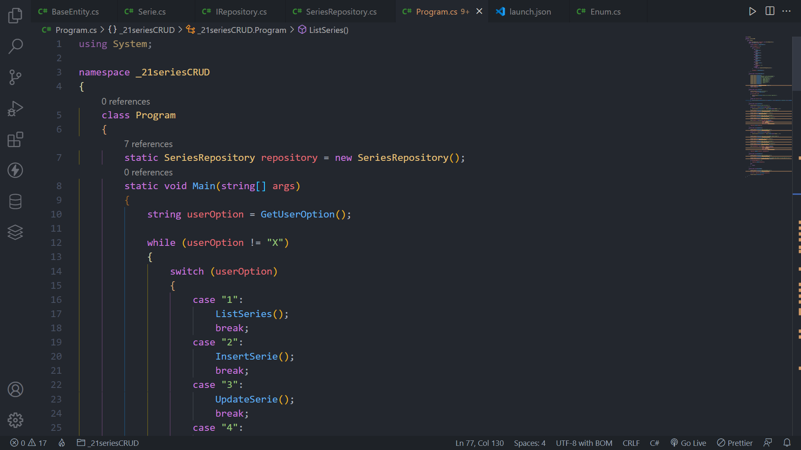

# CRUD Application of Series using C# and Object Oriented Programming.

## Overview

### Screenshot

## My proccess

### Built with

-   C#
-   .NET 6.0

### What i learned

In this project i could apply the acquired knowledge about Object Oriented Programming to develop an application to register, read, insert, update and delete TV series.

Project developed in the Impulse Bootcamp of Digital Innovation One as a console application.

## Author

-   GitHub - Vinícius dos Santos Verissimo (https://github.com/viniciusdsv93)
